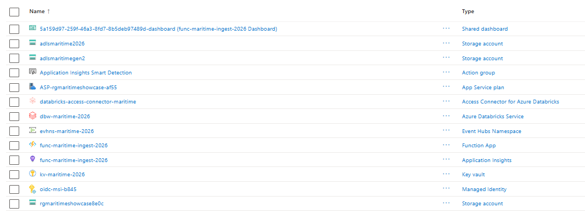
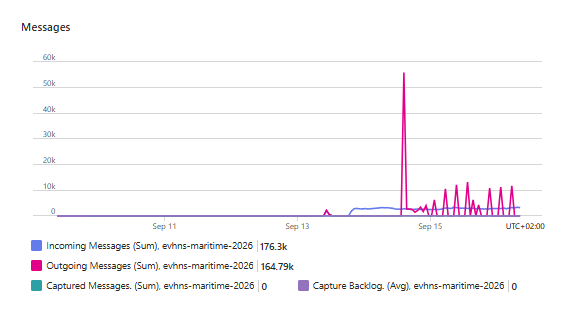
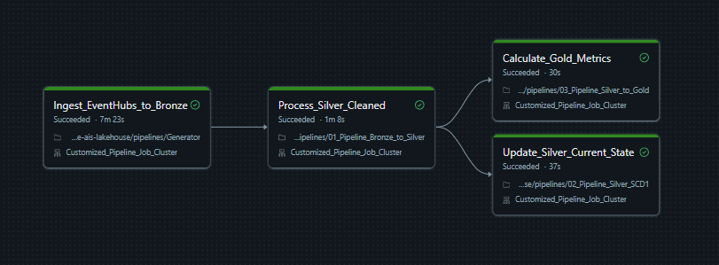
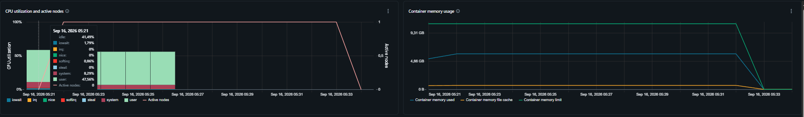
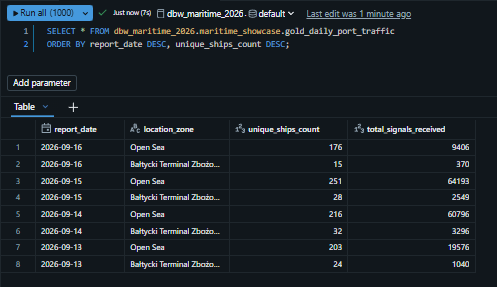

# 🚢 Real-Time Maritime Logistics Lakehouse (2026)

## 📌 Project Overview
An end-to-end, spatial Data Engineering pipeline processing real-time AIS (Automatic Identification System) maritime telemetry alongside batch reference data. The project implements a robust **Medallion Lakehouse Architecture** on Microsoft Azure, focusing on **Zero Trust security**, serverless ingestion, and high-performance spatial analytics using Uber's H3 indexing.

## 🏗️ Architecture & Data Flow
The pipeline employs a dual-ingestion strategy, decoupling high-throughput telemetry streams from slowly changing reference data:

1. **Streaming Data Source (Telemetry):** Real-time vessel positions (JSON) via an external WebSocket API (Aisstream.io).
2. **Streaming Ingestion (Serverless):** `Azure Functions` (Python) continuously listens to the WebSocket and produces events into `Azure Event Hubs` (Kafka API), acting as a high-throughput memory buffer.
3. **Batch Data Source (Reference):** Spatial point-of-interest data (European Ports) queried via the external `OpenStreetMap Overpass REST API`.
4. **Processing (Bronze/Silver/Gold):** `Azure Databricks` (PySpark / SQL) consumes both the Kafka stream (Micro-batching via `availableNow=True`) and the REST API batch payload, processing them through the Medallion architecture.
5. **Storage:** `Azure Data Lake Storage Gen2` (ADLS Gen2) using Delta Lake format with Schema Evolution.
6. **Governance:** `Databricks Unity Catalog` enforcing strict data governance and table management.

*Azure Resource Group highlighting the PaaS/Serverless ecosystem, including Managed Identities and Key Vault for Zero Trust architecture.*

*Azure Event Hubs telemetry traffic showcasing successful serverless data ingestion capable of handling significant message spikes.*

---

## 🔐 Security & "Zero Trust" Implementation
A core focus of this project is enterprise-grade security, completely eliminating hardcoded secrets:
* **CI/CD Deployment:** Automated deployments via `GitHub Actions` using **OIDC (OpenID Connect)** and Federated Identity Credentials. No deployment profiles or passwords are stored in GitHub.
* **Storage Access:** Databricks connects to ADLS Gen2 using a **System-Assigned Managed Identity** (Access Connector for Azure Databricks) directly integrated into Unity Catalog External Locations.
* **API Authentication:** HTTP request headers (e.g., User-Agent) required for external API compliance are retrieved dynamically at runtime using Databricks Secrets backed by `Azure Key Vault`.

---

## ⚙️ Pipeline Orchestration (Databricks Workflows)
The data pipeline is fully automated using **Databricks Workflows**, forming two distinct processes:

**1. Reference Data Refresh (Weekly Batch):**
* Fetches the latest European port definitions via Overpass API with retry mechanisms, un-nests the JSON payload, calculates H3 hexagons, and updates the `dim_world_ports` dimension table.

**2. Telemetry Processing (Micro-batch DAG):**
* **`Ingest_EventHubs_to_Bronze`**: Streams raw payloads from Event Hubs into ADLS Gen2.
* **`Process_Silver_Cleaned`**: Unnests JSON payloads and enriches coordinates with **Uber H3** spatial indexes.
* **Parallel Execution**:
   - **`Update_Silver_Current_State`**: Applies SCD Type 1 logic (`MERGE INTO`) against the H3 port dictionary to maintain a deduplicated, real-time snapshot of vessel positions.
   - **`Calculate_Gold_Metrics`**: Aggregates daily KPIs (unique ships per port vicinity) for BI consumption.

*Databricks Workflows DAG demonstrating task dependencies and successful parallel execution of Silver and Gold transformations.*

---

## 💰 FinOps & Cluster Optimization
To maintain cost-efficiency while ensuring processing reliability, Databricks compute resources were heavily optimized:
* **Right-Sizing:** Replaced default multi-node clusters with a **Single Node** job cluster (`Standard_DS3_v2` equivalent), significantly reducing DBU consumption.
* **Metrics Monitoring:** Ganglia/Spark UI metrics confirmed optimal resource utilization. The container memory usage remains stable (no disk spill) and CPU utilization hovers efficiently around 50%, ensuring the cluster is neither bottlenecked nor over-provisioned.

*Databricks cluster metrics confirming optimal CPU utilization and healthy container memory limits on a Single Node setup.*

---

## 🗺️ Spatial Analytics Results (Gold Layer)
The final business value is delivered in the Gold Layer, where raw GPS coordinates of thousands of vessels have been successfully joined with spatial port data using Uber's H3 resolution matching.

*Databricks SQL query results displaying aggregated daily traffic, effectively distinguishing vessels moored at specific port terminals (e.g., Bałtycki Terminal Zbożowy) from those located in the Open Sea.*

---

## 🚀 Project Roadmap & Status

- [x] **Phase 1: Cloud-Native Infrastructure & Data Producers** (Azure Functions, Event Hubs, OIDC CI/CD)
- [x] **Phase 2: Bronze Layer** (Structured Streaming, Kafka API, Micro-batching)
- [x] **Phase 3: Reference Data Integration** (REST API Batch Ingestion, complex JSON parsing via PySpark `explode`)
- [x] **Phase 4: Silver Layer** (H3 Spatial Engineering, SCD Type 1 via MERGE INTO, Schema Evolution)
- [x] **Phase 5: Gold Layer** (Business Aggregations, Daily Port Traffic metrics)
- [x] **Phase 6: Orchestration & Governance** (Databricks Workflows DAG, Job Clusters)
- [ ] **Phase 7: Serving & BI** (Power BI integration via Databricks SQL Warehouse)

---

## 🛠️ Tech Stack
* **Cloud Provider:** Microsoft Azure
* **Compute:** Azure Databricks, Azure Functions (Serverless)
* **Storage & Messaging:** ADLS Gen2, Azure Event Hubs
* **Data Processing:** PySpark (Structured Streaming, Batch), Databricks SQL
* **Data Formats:** Delta Lake, JSON
* **Governance & Security:** Unity Catalog, Azure Key Vault
* **CI/CD:** GitHub Actions
